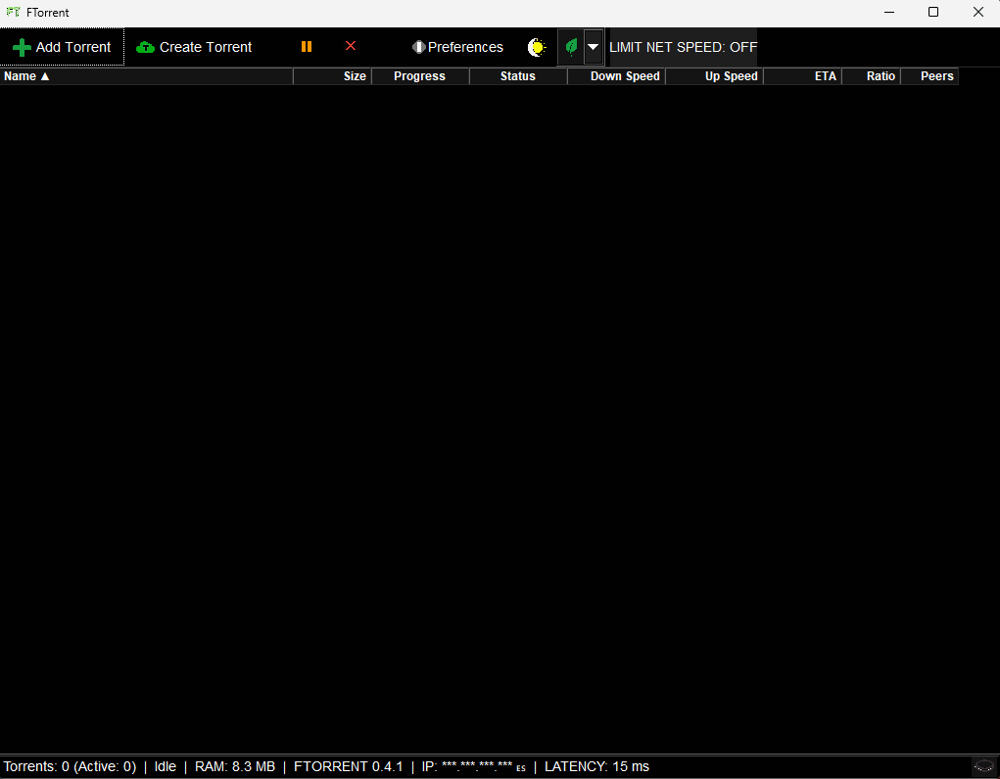

# FTorrent

A lightweight, ad-free BitTorrent client for Windows and Linux, written in **C++20** on top of **FLTK** and **libtorrent-rasterbar**. No Electron, no bundled browser, no telemetry.

[](https://opensource.org/licenses/MIT)
[](https://github.com/thedevil4k/FTORRENT/releases)
[](https://github.com/thedevil4k/FTORRENT/actions/workflows/build.yml)
[](https://github.com/thedevil4k/FTORRENT/stargazers)
[](https://github.com/thedevil4k/FTORRENT/releases)



> [!TIP]
> ### [Download the latest release](https://github.com/thedevil4k/FTORRENT/releases)
> Windows releases ship as a ZIP, Linux as Arch, Debian and RPM packages.

---

## What it does

**Torrents**
- Add a `.torrent` file, a folder or a magnet link — or drop them onto the list window
- Create a `.torrent` from a folder
- Pause and resume per torrent, remove with confirmation
- Sortable list with name, size, progress, status, down speed, up speed, ETA, ratio and peers

**Speed and resource control**
- One-click **50 % rate limit** for the session (magenta when active), released back to your configured limits
- RAM usage mode: **ECO** (zero buffer), **NORMAL** (balanced), **TURBO** (max buffer)
- Global up/down rate limits, connection limits and listen port in Preferences

**Search**
- Search torrents from the toolbar across SolidTorrents, BitSearch, Nyaa.si, The Pirate Bay (HTML and its apibay API), BTDig and Pirate Face — with a proxy/mirror fallback wherever the site offers one
- A status dot next to each engine: green = reachable, red = unreachable, gray = not checked yet (checked once per session, in the background, when you first open search)
- Expand any result to see the files it downloads before downloading anything; names are shown in full whenever the window has room
- Double-click a result (or press Enter) to download it; multi-file magnets offer one checkbox per file, so you fetch only what you want
- Per-site categories and result pages, shown in a dedicated view with a **Back to my torrents** return

**Preferences** — four tabs: General (download path, autostart, tray, public IP), Connection (listen port, rate and connection limits), BitTorrent (DHT, PEX, LSD, UPnP, NAT-PMP), Advanced (user agent, anonymous mode).

**Interface**
- Dark and light themes; dark is the default and theme choice is per session
- Censorship toggle in the status bar, to hide sensitive fields from screenshots
- Status bar with torrent counts, RAM, version, connection latency and — only if you ask for it — your public IP

---

## Building from source

Requires **CMake 3.15+**, a C++20 compiler (GCC 11+, Clang 14+ or VS 2022), **FLTK**, **libtorrent-rasterbar**, **OpenSSL**, zlib, libpng and libjpeg.

```bash
# Linux — installs every build and test dependency first
./scripts/linux/setup/setup-linux.sh

cmake -S . -B build -DCMAKE_BUILD_TYPE=Release
cmake --build build -j"$(nproc)"
./build/FTorrent
```

```powershell
# Windows — installs vcpkg dependencies first
.\scripts\windows\setup-windows.bat

cmake -S . -B build -DCMAKE_BUILD_TYPE=Release
cmake --build build --config Release
```

The app resolves its `assets/` folder next to the executable, so run the binary from the build tree or copy `src/assets/` beside it.

Full step-by-step instructions: **[COMPILE-GUIDE.md](COMPILE-GUIDE.md)**. Packaging and installers: **[scripts/BUILDING.md](scripts/BUILDING.md)**.

## Tests

The suite is CTest-based and off by default, so a normal build stays a plain app build with no test-only dependencies.

```bash
bash scripts/linux/tests/run-tests.sh        # configure, build and run the offline suites
bash scripts/linux/tests/run-tests.sh --all  # include `flows`, which needs the network
```

That is the same three steps CI runs, and on a machine without a graphical session it wraps the run in `xvfb-run`, so the suites still have the display FLTK asks for. By hand, the same thing is:

```bash
cmake -S . -B build -DFTORRENT_BUILD_TESTS=ON
cmake --build build
ctest --test-dir build --output-on-failure
```

| test | what it covers |
| :--- | :--- |
| `toolbar_layout` | toolbar geometry and the level thresholds across every width from 400 to 1920 px |
| `toolbar_clicks` | every toolbar button hit-testable and clickable at the narrowest supported width, plus opening/closing the search view, the engine status dots and a clean, segfault-free shutdown |
| `icons_full` / `icons_missing` | icon rendering, toolbar levels and spacing, with and without the on-disk assets |
| `flows` | preferences, add, remove, rate limit, search, file lists, pause/resume end to end |

`flows` touches the network and is labelled `network`; drop it with `ctest --test-dir build -LE network` for an offline run. Tests redirect the settings directory to their own scratch space and never read or delete yours.

CI builds and runs the offline subset on pushes and pull requests that touch code; see [.github/workflows/build.yml](.github/workflows/build.yml).

---

## Repository layout

| path | contents |
| :--- | :--- |
| `src/` | the application: `MainWindow`, `TorrentSession`/`TorrentManager`, `SearchEngine`, `PreferencesDialog`, `AssetLoader`, `Resources`, `ToolbarLayout` |
| `tests/` | the CTest suite |
| `scripts/` | dependency setup, compilation and packaging scripts per platform |
| `docs/` | the public site sources (`index.html`) and its assets |
| `packaging/` | Arch, deb and rpm packaging |

Architecture notes live in **[ARCHITECTURE.md](ARCHITECTURE.md)**.

---

## Documentation

- **[FUTURE_UPDATES_IDEAS.md](FUTURE_UPDATES_IDEAS.md)** — evaluated ideas we parked (and why), in Spanish and English
- **[USER-GUIDE.md](USER-GUIDE.md)** — using the client
- **[ARCHITECTURE.md](ARCHITECTURE.md)** — how the code is put together
- **[UI-DESIGN.md](UI-DESIGN.md)** — interface and layout rules
- **[MULTITHREADING-ARCHITECTURE.md](MULTITHREADING-ARCHITECTURE.md)** — the asynchronous core
- **[TECHNICAL-REFERENCE.md](TECHNICAL-REFERENCE.md)** — developer reference
- **[DEPLOYMENT.md](DEPLOYMENT.md)** — releases and packaging

---

## What changed recently

- **Toolbar rebuilt around one owner.** Bar and button sizes, spacing, the three toolbar levels and the centring arithmetic all live in [`src/ToolbarLayout`](src/ToolbarLayout.h), a policy module with no FLTK dependency. The bar is centred at every width from the 720 px minimum upwards, and the child count that `requiredWidth()` multiplies by the gap is derived from the same table that sizes the widgets, with a startup check that aborts if the pack ever disagrees.
- **Assets load from disk with a compiled-in fallback.** [`AssetLoader`](src/AssetLoader.h) provides the toolbar PNGs at the right size; if one is missing, the built-in glyph is used instead, so a button is never blank. The XPM glyphs are resampled to 26 px at startup rather than scaled by the widget.
- **Public IP in the status bar is off by default.** A new installation does not look its address up online until you tick the box; an existing `ShowPublicIp=true` is left alone.
- **The 50 % rate limit button says so.** Its tooltip now reads `Limit network speed 50%`.
- **A test suite in the repository.** Five CTest programs, built from the same objects the app ships.
- **Search engines report their reachability.** A green, red or gray dot next to each engine in the dropdown, probed once per session with no new dependencies.
- **Magnets can be picked file by file.** The Add dialog lists a magnet's already-resolved files with one checkbox each; the file rows under each result are separated so multi-file torrents read clearly.
- **Search results survive small windows and use wide ones.** Names ellipsize by pixels (full name when it fits), double-click and Enter both download, and cancelling the dialog keeps the results.
- **Probe threads shut down cleanly.** Engine checks are joinable workers instead of detached threads, which fixes an exit segfault the suite caught; `FUTURE_UPDATES_IDEAS.md` parks what we evaluated and deferred.

## License

Distributed under the MIT License.